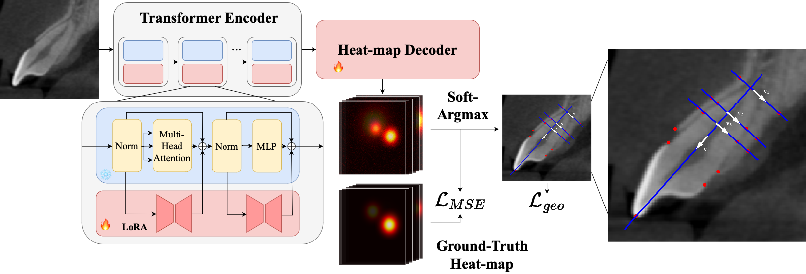

# Geometric-Guided Few-Shot Dental Landmark Detection with Human-Centric Foundation Model

<div align="center">

[](https://arxiv.org/abs/2507.04710)


</div>


###### Anbang Wang, [Marawan Elbatel](https://marwankefah.github.io/), Keyuan Liu, Lizhuo Lin, Meng Lan, Yanqi Yang, [Xiaomeng Li](https://xmengli.github.io/)


This is the official implementation of "Geometric-Guided Few-Shot Dental Landmark Detection with Human-Centric Foundation Model (MICCAI 2025)".

## Abstract
Accurate detection of anatomic landmarks is essential for assessing alveolar bone and root conditions, thereby optimizing clinical outcomes in orthodontics, periodontics, and implant dentistry. Manual annotation of landmarks on cone-beam computed tomography (CBCT) by dentists is time-consuming, labor-intensive, and subject to inter-observer variability. Deep learning-based automated methods present a promising approach to streamline this process efficiently. However, the scarcity of training data and the high cost of expert annotations hinder the adoption of conventional deep learning techniques. To overcome these challenges, we introduce GeoSapiens, a novel few-shot learning frame- work designed for robust dental landmark detection using limited annotated CBCT of anterior teeth. Our GeoSapiens framework comprises two key components: (1) a robust baseline adapted from Sapiens, a foundational model that has achieved state-of-the-art performance in human-centric vision tasks, and (2) a novel geometric loss function that improves the model’s capacity to capture critical geometric relationships among anatomical structures. Experiments conducted on our collected dataset of anterior teeth landmarks revealed that GeoSapiens surpassed existing landmark detection methods, outperforming the leading approach by an 8.18% higher success detection rate at a strict 0.5 mm threshold-a standard widely recognized in dental diagnostics.



## Getting Started

### Installation
1. Clone the repository
    ```sh
    git clone https://github.com/xmed-lab/GeoSapiens
    cd GeoSapiens
    export GeoSapiensBase='path/to/current/folder'
    ```
2. Install the environment
    ```sh
    cd _install
    ./install.sh
    ```

### Download Data and Model Weights
3. Download the data: To get access to the data we used, please contact us by sending email to lky0527@connect.hku.hk. After you obtain the data, you should organize it with following structure: 
   ```plaintext
   data/
   └── teeth/
       ├── annotations/
           ├── annotations_train.json
           ├── annoataions_val.json
           └── annotations_test.json
       └── imageTr_clean
           ├──FA0987_11.png
           └──...
   ```
   
4. Download the model weights:
   For pretrained weight of sapiens-0.3b, please download sapiens_0.3b_epoch_1600_clean.pth from huggingface with at https://huggingface.co/facebook/sapiens-pretrain-0.3b. And put the file in folder pretrain/checkpoints/sapiens_0.3b.
   For our model: We introduce our geometric loss after 100 epochs. We provide both the checkpoint at 100 epochs as well as the final weight at 210 epochs.
   ```sh
   gdown 1_Aah0yZDk2HTvJLaq46nweNccDArQ6K9 -O pretrain/checkpoints/sapiens_0.3b/epoch_100.pth
   gdown 1EXmt_yCxiEh6dNo341i-_qr1ft27XU1k -O pretrain/checkpoints/sapiens_0.3b/epoch_210.pth
   ```
   
## Generating Predictions and Evaluation

1. Run the inference: 
   ```sh
   cd ${GeoSapiensBase}/pose/scripts/test/teeth/lora_sapiens_0.3b
   ./node.sh
   ```
   The output folder will be saved in pose/Outputs folder with specific time stamp. The dump.pkl in the result folder contains the predicted landmarks' information. 

2. To evaluate the results, you should change the file evaluation/evaluaion.py by adding the specific path of the pkl file you obtained in step one on line 23. Then
   ```sh
   cd ${GeoSapiensBase}/evaluation
   python evaluation.py
   ```

## Training GeoSapiens

1. During our training of GeoSapiens, we introduce our geometric loss at 100 epochs. Therefore you can resume from the model at 100 epochs to finish the training. 

    ```sh
    cd ${GeoSapiensBase}/pose/scripts/finetune/teeth/lora_sapiens_0.3b
    ./node.sh
    ```
If you want to only use MSEloss or change the weight of geometric loss, you should modify the configuration at pose/configs/GeoSapiens/teeth/lora_sapiens_0.3b-210e_teeth-1024x768.py. Loss configuration is on line 128. 
If you want to start training from the beginning, you should set RESUME_FROM in node.sh to be ''. 

### Acknowledgment
Code is built on [sapiens](https://github.com/facebookresearch/sapiens).

### Citation
````
@article{wang2025geosapiens,
  title={Geometric-Guided Few-Shot Dental Landmark Detection with Human-Centric Foundation Model},
  author={Anbang Wang and Marawan Elbatel and Keyuan Liu and Lizhuo Lin and Meng Lan and Yanqi Yang and Xiaomeng Li},
  journal={arXiv preprint arXiv:2507.04710},
  year={2025}
}
````